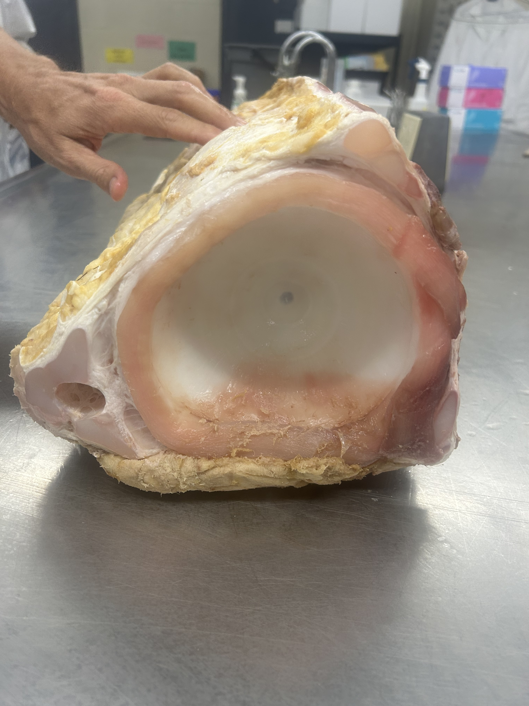

```{r setup, include=FALSE}
knitr::opts_chunk$set(echo = TRUE, message = FALSE, warning = FALSE)
```

# Learning Objectives

1.  Use R markdown syntax for formatting, including headings, lists, tables, and inline code
2.  Modify code chunk options (`echo`, `eval`, `include`, `fig.width`)
3.  Combine what we've learned about spatial and temporal data to interpret and plot movement data of a tagged basking shark
4.  Render a scientific report using `knitr` as an HTML

# Part 1: R Markdown Basics

Before we dive into shark data, let's practice some R Markdown fundamentals. This section demonstrates key formatting features, you'll use these skills when writing up your analysis later. We've been working in `Visual` mode, but you can always check the `Source` view to see examples from this (or other) exercises.

## 1.1 Headings

Headings are created with `#` symbols. More `#` = smaller heading:

```         
# Heading 1 (largest)
## Heading 2
### Heading 3
#### Heading 4 (smallest)
```

## 1.2 Text formatting

You can make text **bold** with double asterisks: `**bold**`

You can make text *italic* with single asterisks: `*italic*`

You can make text ***bold and italic*** with triple asterisks: `***bold and italic***`

You can create `inline code` with backticks: `` `inline code` ``

## 1.3 Lists

**Bullet lists** use `-` or `*`:

-   First
-   Second
    -   Nested item (indent with 2 spaces)
    -   Another nested item
-   Third

**Numbered lists** use numbers:

1.  First
2.  Second
3.  Third

## 1.4 Links and images

Links use this format: `[text](url)`

Example: [Basking Shark Wikipedia](https://en.wikipedia.org/wiki/Basking_shark) , \<- check what this looks like in source view.

Images use `` The path here is relative to the RMD file which is `Lab9/Script`, so the path for the figure is `../Figures/Vertebra.jpg`



OR, you can embed them the following way. The path can be tricky when knitting depending on where your directory is, if you have major issues go with the URL approach. Notice the path here is different from above, and now relative to the knit working directory. Confusing!

```{r fig.align="center", echo=FALSE, include=TRUE, out.width="60%"}
knitr::include_graphics(("../Figures/Vertebra.jpg"))
```

## 1.5 Tables in Markdown

You can create simple tables manually:

| Species       | Max Length (m) | Feeding mechanism |
|---------------|----------------|-------------------|
| Basking shark | 12             | Filter feeder     |
| Great white   | 6              | Chomper           |
| Whale shark   | 18             | Filter feeder     |

The syntax looks like this:

```         
| Column 1 | Column 2 |
|----------|----------|
| Data 1   | Data 2   |
```

These look very pretty when knit together, but they can be cumbersome.

## 1.6 Code chunks

Code chunks are where we have been coding: They start with ```` ```{r} ```` and end with ```` ``` ```` .

You can name chunks and set options for how the chunk will render when knit:

-   `echo = FALSE` — hides the code, shows only output
-   `eval = FALSE` — shows code but doesn't run it
-   `include = FALSE` — runs code but hides everything
-   `fig.width =` — sets figure width in inches (can also set `fig.height =...` ) - defaults are width=7 and height=5

```{r echo-false-example, echo=FALSE}

shark_weight_kg <- 2000
shark_weight_kg * 2.2  # Convert to pounds

```

```{r eval-false-example, eval=FALSE}

# This code is displayed but not executed
install.packages("ggplot2")  # You wouldn't want this running every knit!


```

```{r include-false-example, include=FALSE}

#chunk runs but produces no visible output
a <- 2+2
```

```{r fig-size-default, fig.width=7, fig.height=5}

plot(1:10, main = "Regular plot")


```

```{r fig-size-small, fig.width=4, fig.height=3}

#these settings are smaller than the default
plot(1:10, main = "Small plot")

```

## 1.7 Inline R code

You can embed R results in text using backticks with `r`:

The `basking shark` is the coolest shark.

------------------------------------------------------------------------

### EXERCISE 1: Practice formatting

Move to source view and practice by writing the following in the space below.

1.  A level-3 heading with your name
2.  A sentence with **bold** and *italic* text
3.  A bullet list of 3 marine animals
4.  A simple 2-column table

*Add your practice content here:*

------------------------------------------------------------------------

# Part 2: Setup and Data

Now let's load our packages and data.

## 2.1 Load packages

```{r load-packages}
packages <- c("tidyverse", "sf", "rnaturalearth", "rnaturalearthdata")

# Install packages not yet installed
installed_packages <- packages %in% installed.packages()

if (any(installed_packages == FALSE)) {
  install.packages(packages[!installed_packages])
}

# Packages loading
invisible(lapply(packages, library, character.only = TRUE))
```

## 2.2 Load spatial polygons

We'll use Natural Earth data to get coastlines (as we've been doing).

```{r load-spatial-data}
# Country polygons for the Americas
coast <- ne_countries(scale = "medium", returnclass = "sf")

# Ocean polygon
ocean <- ne_download(scale = "medium", 
                     type = "ocean", 
                     category = "physical",
                     returnclass = "sf")
```

## 2.3 Load shark tracking data

```{r load-shark-data}
# Download shark tracking data directly, ERDDAP servers often go down for maintenance, looks like that's currently the case 
#sharks <- read.csv("https://erddap.bco-dmo.org/erddap/tabledap/bcodmo_dataset_476315.csv", 
                   #skip = 1)  # Skip the units row

#We'll load the csv directly to be safe
sharks <- read.csv("../Data/basking_sharks.csv")
sharks <- sharks[-1,]

# Clean column names
colnames(sharks) <- c("ptt", "tuid", "year", "month", "day", "longitude", "latitude", 
                      "date", "type", "depth_min", "temp_depth_min", "depth_max", 
                      "depth_range", "tsst")

# Convert date column and add month name
sharks <- sharks %>%
  mutate(
    across(c(ptt, tuid, year, month, day, longitude, latitude, 
             depth_min, temp_depth_min, depth_max, depth_range, tsst), as.numeric),
    date = as.Date(date, format = "%m/%d/%Y"),
    month_name = month.abb[month]
  )


# Convert to spatial object
sharks_sf <- st_as_sf(sharks, 
                      coords = c("longitude", "latitude"),
                      crs = 4326)
```

## 2.4 Explore available sharks

```{r summary-table}
shark_summary <- sharks %>%
  group_by(ptt) %>%
  summarise(
    n_locations = n(),
    start_date = min(date, na.rm = TRUE),
    end_date = max(date, na.rm = TRUE),
    days_tracked = as.numeric(end_date - start_date),
    min_lat = min(latitude),
    max_lat = max(latitude)
  ) %>%
  arrange(desc(days_tracked))

#kable turns a dataframe into a nicely formatted table, much better than the raw output of shark_summary
knitr::kable(shark_summary, 
             digits = 1)
```

------------------------------------------------------------------------

## 2.5 Plot their migration

```{r fig.align="center", echo=FALSE, include=TRUE, out.width="60%"}
knitr::include_graphics(("../Figures/all_sharks_migration.png"))

```

# Part 3: Worked Example : Shark 52556

Let's work through an analysis on the path of shark **52556** — this individual made a journey from Cape Cod all the way to Brazil.

## 3.1 Filter to one shark

```{r demo-filter}
demo_shark <- 52556

demo_data <- sharks %>%
  filter(ptt == demo_shark) %>%
  arrange(date)

demo_sf <- sharks_sf %>%
  filter(ptt == demo_shark) %>%
  arrange(date)

```

## 3.2 Map the migration

```{r fig.align="center", echo=FALSE, include=TRUE, out.width="60%"}
knitr::include_graphics(("../Figures/shark_52556_migration.png"))

```

**What we see:** This shark was tagged in summer (July) off Massachusetts, then migrated south along the US coast, through the Caribbean, and ended up near the equator off Brazil by April.

------------------------------------------------------------------------

# Part 4: Your Analysis

Now it's your turn! Choose a different shark and create your own analysis.

## 4.1 Choose your shark

Look at the summary table in Section 2.4 and pick a shark that interests you.

```{r your-shark, eval=FALSE}

my_shark <-  #Your shark here

# Filter data
my_data <- sharks %>%
  filter(ptt == my_shark) %>%
  arrange(date)

my_sf <- sharks_sf %>%
  filter(ptt == my_shark) %>%
  arrange(date)

```

## 4.2 Create your map

Below is starter code for your map.

```{r, eval=FALSE}
# Edit the settings of this chunk to render appropriately, what do you need to add to {r}?


# Calculate map extent from this shark's data
bbox <- st_bbox(demo_sf)
xlim <- c(bbox["xmin"] - 3, bbox["xmax"] + 3)
ylim <- c(bbox["ymin"] - 3, bbox["ymax"] + 3)

# Build the map layer by layer
ggplot() +
  # Layer 1: Ocean background
  geom_sf() +
  
  # Layer 2: Land polygons
  geom_sf() +
  
  # Layer 3: Track line connecting points
  geom_path() +
  
  # Layer 4: Points colored by month
  geom_point() +
  
  # Layer 5: Start point (green triangle)
  geom_point() +
  
  # Layer 6: End point (red square)
  geom_point() +
  
  # Set map extent
  coord_sf(xlim = xlim, ylim = ylim, expand = FALSE) +
  scale_fill_manual(
  name = "Month",
  values = c("Jan" = "#313695", "Feb" = "#4575b4", "Mar" = "#74add1",
             "Apr" = "#abd9e9", "May" = "#e0f3f8", "Jun" = "#fee090",
             "Jul" = "#fdae61", "Aug" = "#f46d43", "Sep" = "#d73027",
             "Oct" = "#a50026", "Nov" = "#762a83", "Dec" = "#40004b")
  )+
  labs(
    title = paste("Migration of Basking Shark", #your shark name here),
    x = "Longitude", y = "Latitude"
  ) +
  theme_minimal() +
  theme(
    plot.title = element_text(size = 16, face = "bold"),
    legend.position = "right"
  )
```

------------------------------------------------------------------------

# Part 5: Session Info and Knit

Session info prints out a snapshot of your R environment at the time the doc was knitted, can be helpful for reproducibility if someone else is trying to run your code.

Knitting sets your working directory to wherever the file is hosted.

```{r session-info}
sessionInfo()
```

------------------------------------------------------------------------

# YOUR TO DO LIST :

### How you present and organize your markdown is flexible, get creative with it! This is what you should include:

-   Create your own markdown file as a report with the appropriate YAML header for an HMTL including your name, and the date

-   Load packages, spatial polygons, and shark data (you can use the code from this document -lab 9- for this )

-   Choose a shark and filter the data for it (rename your shark if you like)

-   Complete the spatiotemporal plot of your sharks migration based on the pseudo code provided

-   Deduce and summarize aspects of its journey :

    -   Its start and end locations
    -   The latitudinal change (difference between max and min latitude)
    -   The total distance your shark traveled in km

-   Include the following markdown elements somewhere in your report :

    -   Headings
    -   Bold text
    -   Italicized text
    -   An embedded figure of a basking shark (find online)
    -   A table

-   **Knit your document and submit as an HMTL on brightspace**

-   THIS ASSIGNMENT IS BEING GRADED BASED ON YOUR SUBMITTED HTML FILE, CONTAINING ALL INFORMATION ABOVE. It is not a coding-based assignment *per se*.

## Congrats on 9 completed assignments!! :)

**Data citation:** Thorrold, S., Houghton, L., Skomal, G. (2014). Most probable track estimates from basking sharks tagged in the Northwest Atlantic Ocean 2004-2011. BCO-DMO. DOI: [10.1575/1912/bco-dmo.476315.1](https://doi.org/10.1575/1912/bco-dmo.476315.1)
